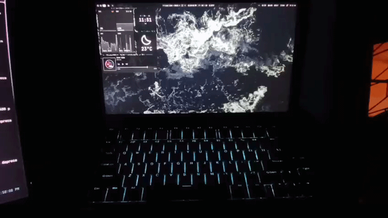
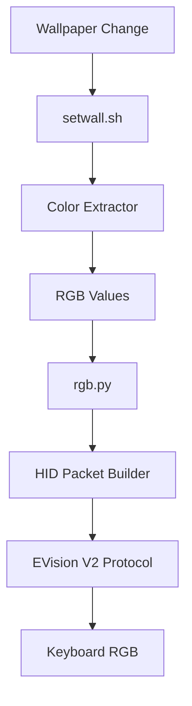
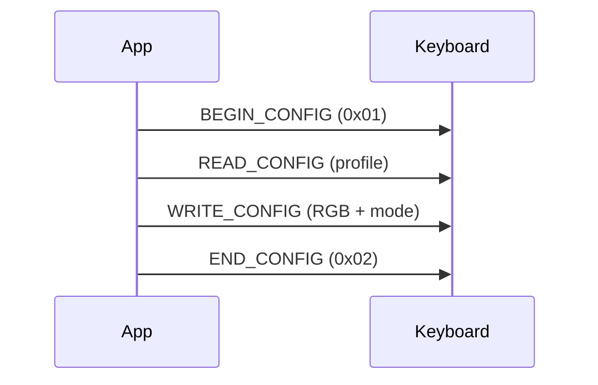

# EvoFox Ronin RGB Control

Minimal userspace control for **EvoFox Ronin (VID: 320F, PID: 5055)** using raw HID (EVision V2 protocol).

## Working




## Features

- Static RGB control via Python (`hidapi`)
- Wallpaper → color → keyboard pipeline
- Works on Wayland (Niri, DMS)
- No OpenRGB required

## Usage

```bash
python rgb.py #00ffcc
````

With wallpaper sync:

```bash
./setwall.sh --screen eDP-1 /path/to/wallpaper.jpg
```

## Requirements

* Python + `hid` (`hidapi`)
* (Optional) Pillow for color extraction
* Access to `/dev/hidraw*` (udev rule recommended)

## Architecture



## Protocol



## Special Thanks

- [EvoFox Ronin WebHID Controller](https://evofox.rdmctmzt.com/)
- [OpenRGB](https://openrgb.org/) (For Protocol Hints)